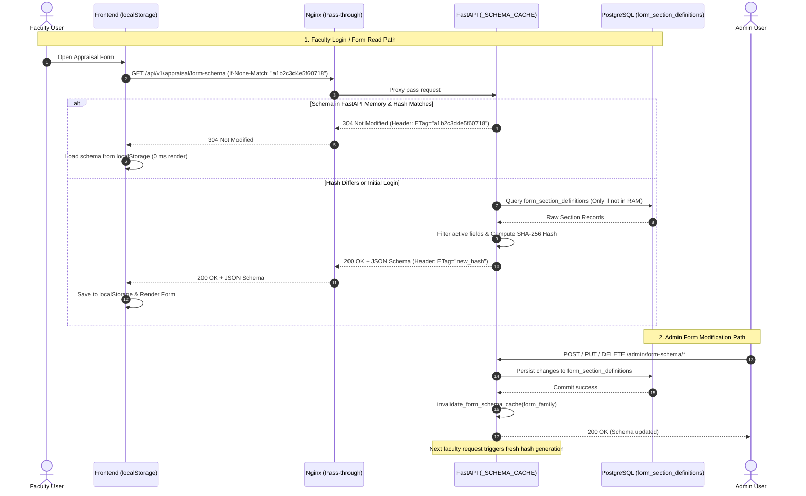

# Dynamic Form Builder: Schema Caching & ETag/Hash Architecture

## 1. Overview & System Purpose

The **Form Builder** module enables administrators to dynamically create, configure, update, archive, and delete appraisal forms (such as *Standard Appraisal*, *Creative Appraisal - Media Communication*, *Creative Appraisal - Design Arts*, and custom school variants).

### The Challenge
In an on-premise, local server deployment (using Docker containers and an Nginx reverse proxy), thousands of faculty members access the portal simultaneously during peak appraisal submission windows. If every client fetched and re-parsed the full form schema JSON from PostgreSQL on every login, database connection pools and CPU cycles would experience extreme spikes.

### The Solution: Multi-Tier Zero-Overhead Caching
To maintain sub-millisecond response times and eliminate database overhead without placing caching stress on Nginx:
1. **Backend RAM Caching**: FastAPI maintains active schemas in memory (`_SCHEMA_CACHE`). DB queries only occur once per form family on initial request or after an admin edits a form.
2. **Content Hashing & ETags**: Every schema version is fingerprinted with a 16-character SHA-256 hash.
3. **HTTP 304 Not Modified**: If the faculty browser already holds the latest schema hash, the backend immediately returns `304 Not Modified` with **0 DB queries** and **0 response body bytes**.
4. **Client-Side Persistence**: The frontend persists schemas and hashes in browser `localStorage`, ensuring instant form rendering (**0 ms latency**).

---

## 2. End-to-End Architecture Flow



---

## 3. Component Reference & Source Code Mapping

### 3.1 Backend: In-Memory Cache & ETag Verification
* **File:** `src/api/v1/appraisal.py`
* **Symbols:**
  * `_SCHEMA_CACHE: Dict[str, Dict[str, Any]]`: Process-level dictionary mapping `{cache_key: {"data": [...], "hash": "..."}}`.
  * `invalidate_form_schema_cache(form_family: Optional[str] = None)`: Invalidates specific family keys or the entire cache.
  * `get_appraisal_form_schema(...)` (`GET /api/v1/appraisal/form-schema`):
    * Checks `_SCHEMA_CACHE` for `cache_key` (`{family}__{academic_year}`).
    * Computes SHA-256 hash using `hashlib.sha256(json.dumps(...).encode('utf-8')).hexdigest()[:16]`.
    * Inspects request `If-None-Match` header and returns `304 Not Modified` if equal to ETag.

### 3.2 Backend: Cache Invalidation Triggers
* **File:** `src/api/v1/admin.py`
* **Trigger Points:**
  * `create_admin_form_section` (`POST /api/v1/admin/form-schema`) $\rightarrow$ `invalidate_form_schema_cache(section.form_family)`
  * `update_admin_form_section_metadata` (`PUT /api/v1/admin/form-schema/{code}`) $\rightarrow$ `invalidate_form_schema_cache(section.form_family)`
  * `update_admin_form_section_fields` (`PUT /api/v1/admin/form-schema/{code}/fields`) $\rightarrow$ `invalidate_form_schema_cache(section.form_family)`
  * `delete_admin_form_section` (`DELETE /api/v1/admin/form-schema/{code}`) $\rightarrow$ `invalidate_form_schema_cache(section.form_family)`
  * `archive_admin_form_family` (`POST /api/v1/admin/form-families/{family}/archive`) $\rightarrow$ `invalidate_form_schema_cache(family)`
  * `delete_admin_form_family` (`DELETE /api/v1/admin/form-families/{family}`) $\rightarrow$ `invalidate_form_schema_cache(family)`

### 3.3 Frontend: Storage & Conditional Sync Service
* **File:** `Appraisal-form-2.0/src/features/faculty-appraisal/services/formSchemaService.js`
* **Symbols:**
  * `fetchFormSchema({ formFamily, academicYear })`:
    * Retrieves cached schema from `localStorage` under `appraisal_schema_{family}__{year}`.
    * Sends `If-None-Match: cachedEtag` via Axios client (`validateStatus: 200 || 304`).
    * On `304`: Instantly parses and returns local cached schema.
    * On `200`: Updates `localStorage` schema and `appraisal_etag_{family}__{year}`.
  * `clearFormSchemaCache()`: Clears memory map and purges all `appraisal_schema_*` and `appraisal_etag_*` entries from `localStorage` and `sessionStorage`.

---

## 4. Docker & Database Persistence Rules

Because this project is hosted on a local on-premise server:

1. **PostgreSQL Volume Guarantee**:
   All dynamic form definitions and custom field rows are stored in the PostgreSQL database table `form_section_definitions` and `custom_section_rows`.
   To ensure definitions are **never lost** during container rebuilds, the database container must use a persistent Docker volume:
   ```yaml
   services:
     db:
       image: postgres:15-alpine
       volumes:
         - pgdata:/var/lib/postgresql/data
   volumes:
     pgdata:
       driver: local
   ```

2. **Stateless Backend Rebuilds**:
   The backend container `faculty_appraisal_backend` holds only application code. Stopping, removing, and rebuilding it (`docker compose build --no-cache server`) will **not** erase or reset database tables.

3. **Flyway Migration Safety**:
   Automated migrations in `src/setup/database.py` execute `CREATE TABLE IF NOT EXISTS` and `ALTER TABLE ... ADD COLUMN IF NOT EXISTS`. Startup migrations do not drop tables or truncate records.

---

## 5. Maintenance & Troubleshooting

### How to Force Clear the Schema Cache
* **Backend**: Restart the backend container or call `invalidate_form_schema_cache()` in Python.
* **Frontend / User Browser**: Call `clearFormSchemaCache()` in developer console or clear site storage in browser settings (`localStorage.clear()`).

### Verifying ETag & 304 in Network DevTools
1. Open Browser DevTools $\rightarrow$ **Network** tab.
2. Filter for `form-schema`.
3. First request: Status **`200 OK`**, Response Headers contain `ETag: "xxxxxxxxxxxxxxxx"`.
4. Refresh page: Status **`304 Not Modified`**, Transferred size is **~100 B** instead of ~20 KB.
