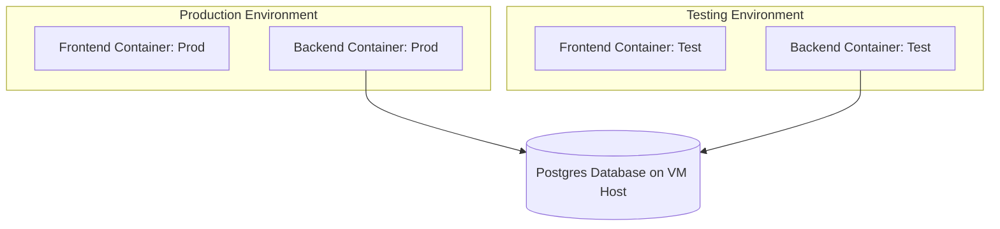

# Local VM Deployment Context & Testing Setup

This document records the operational context, network details, and setup configuration for running the Faculty Appraisal System on the local VM. It is disconnected from standard GCP pipelines and is used directly by the college.

---

## 1. Network & Host Environment

*   **OS/Environment:** Linux-based Virtual Machine (VM), accessed via SSH.
*   **IP Addresses:**
    *   **Internal IP:** Accessible only when connected to the college's local network (reliable).
    *   **Public IP:** Accessible anywhere, mapped to the public URL, but currently unreliable/unstable.
*   **CORS Configuration:** Modified directly on the VM (not pushed to GitHub) to allow connections from the relevant local/public client origins.

---

## 2. Container Architecture

Currently running **2 containers** for production and expanding to **4 containers** to allow safe testing:



*   **Production Stack:**
    1.  **Frontend (Production)**: Connects to the production backend.
    2.  **Backend (Production)**: Connects to the production database schema.
*   **Testing Stack (To be added):**
    1.  **Frontend (Testing)**: Configured to point to the testing backend.
    2.  **Backend (Testing)**: Configured to point to a test database/schema to prevent dirtying production data.

---

## 3. Build & Run Workflow

Deployments on the local VM do not use Docker Compose (`docker-compose.yml` or `compose.yaml`). Instead, updates are pulled and run manually:
1.  Pull updates via `git clone` / `git fetch` and `git checkout` on the host VM.
2.  Build containers manually via `docker build`.
3.  Run containers via manual `docker run` commands.

---

## 4. File Upload Storage Resolution (Data Persistence)

### The Problem
By default, backend files are stored inside the container if `USE_LOCAL_STORAGE=true`. Since Docker containers are ephemeral, any container rebuild or restart would cause all uploaded appraisal PDF documents to be lost.

### The Solution: Persistent Bind Mounts
Map a directory on the host VM to the container's `/app/uploads` path. This ensures uploaded PDFs persist on the VM host's filesystem.

1.  **Environment Configuration:**
    Ensure the following environment variables are passed to the backend container:
    *   `USE_LOCAL_STORAGE=true`
    *   `LOCAL_STORAGE_DIR=/app/uploads`

2.  **Verified Docker Run Command:**
    The verified command used to run the backend container with persistent uploads storage, host networking, and configuration file mapping is:
    
    ```bash
    sudo docker run -d \
      --name faculty_appraisal_backend \
      --add-host=host.docker.internal:host-gateway \
      -v /home/dypiu/uploads:/app/uploads \
      --env-file /home/dypiu/Faculty_appraisal/.env \
      -p 8000:8080 \
      faculty_appraisal_backend
    ```

    *Ensure that the host path `/home/dypiu/uploads` is created and writable by the user/group that runs the Docker engine.*

---

## 5. Mapping to the Public URL

Once testing is complete, traffic from the public URL of the college website will be mapped.
*   A reverse proxy (e.g., Nginx running on the host or a gateway router) should route requests from the public domain (e.g., `appraisal.college.edu`) to the internal IP and frontend container port.
*   The backend public port will need to be mapped to `/api` or a subdomain (e.g., `api-appraisal.college.edu`).
