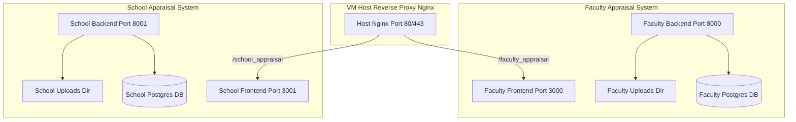

# Local VM Deployment Context & Testing Setup

This document records the operational context, network details, and setup configuration for running the Faculty Appraisal System on the local VM. It is disconnected from standard GCP pipelines and is used directly by the college.

---

## 1. Network & Host Environment

*   **OS/Environment:** Linux-based Virtual Machine (VM), accessed via SSH.
*   **IP Addresses:**
    *   **Internal IP:** Accessible only when connected to the college's local network (reliable).
    *   **Public IP:** Accessible anywhere, mapped to the public URL, but currently unreliable/unstable.
*   **CORS Configuration:** Modified directly on the VM (not pushed to GitHub) to allow connections from the relevant local/public client origins.

---

## 2. Multi-Project & Container Architecture

The VM hosts multiple separate appraisal systems running side-by-side. Each system is entirely isolated (separate codebases, docker containers, databases, and upload directories) but shares the same physical VM host:

*   **Faculty Appraisal System** (Current project)
    *   Frontend container: Serves on port `3000` (internally `8080`)
    *   Backend container: Serves on port `8000` (internally `8080`)
*   **School Appraisal System** (Parallel project)
    *   Frontend container: Serves on port `3001` (internally `8080`)
    *   Backend container: Serves on port `8001` (internally `8080`)



### Production vs Testing Containers
To prevent dirtying production data, testing containers are planned for each stack:
1.  **Frontend (Testing)**: Configured to point to the testing backend.
2.  **Backend (Testing)**: Configured to point to a test database/schema on the host.


---

## 3. Build & Run Workflow

Deployments on the local VM do not use Docker Compose (`docker-compose.yml` or `compose.yaml`). Instead, updates are pulled and run manually:
1.  Pull updates via `git clone` / `git fetch` and `git checkout` on the host VM.
2.  Build containers manually via `docker build`.
3.  Run containers via manual `docker run` commands.

---

## 4. File Upload Storage Resolution (Data Persistence)

### The Problem
By default, backend files are stored inside the container if `USE_LOCAL_STORAGE=true`. Since Docker containers are ephemeral, any container rebuild or restart would cause all uploaded appraisal PDF documents to be lost.

### The Solution: Persistent Bind Mounts
Map a directory on the host VM to the container's `/app/uploads` path. This ensures uploaded PDFs persist on the VM host's filesystem.

1.  **Environment Configuration:**
    Ensure the following environment variables are passed to the backend container:
    *   `USE_LOCAL_STORAGE=true`
    *   `LOCAL_STORAGE_DIR=/app/uploads`

2.  **Verified Docker Run Command:**
    The verified command used to run the backend container with persistent uploads storage, host networking, and configuration file mapping is:
    
    ```bash
    sudo docker run -d \
      --name faculty_appraisal_backend \
      --add-host=host.docker.internal:host-gateway \
      -v /home/dypiu/uploads:/app/uploads \
      --env-file /home/dypiu/Faculty_appraisal/.env \
      -p 8000:8080 \
      faculty_appraisal_backend
    ```

    *Ensure that the host path `/home/dypiu/uploads` is created and writable by the user/group that runs the Docker engine.*

---

## 5. Nginx Reverse Proxy Setup & Routing Strategy

## 5. Selected Routing Strategy: Subpath Routing (Faculty at Root /, School at /AAA)

Since subdomain creation is restricted by the network admin, both systems are served under the main domain `pbas.dypiu.ac.in` using sub-paths:
*   **Faculty Appraisal:** Served at the root path `pbas.dypiu.ac.in/` (Frontend Port 3000, Backend Port 8000)
*   **School Appraisal (AAA):** Served at the sub-path `pbas.dypiu.ac.in/AAA/` (Frontend Port 3001, Backend Port 8001)

---

### Codebase Changes Required

#### A. Faculty Appraisal (Served at Root `/`)
Since it is hosted at the root of the domain:
*   **Vite Base Path:** Remains `/` (no changes needed in `vite.config.js`).
*   **React Router Basename:** Remains `/` (no changes needed in `App.jsx`).
*   **Frontend `.env` (`VITE_API_BASE_URL`):** `/api/v1` (no changes needed).

#### B. School Appraisal (Served at `/AAA/`)
Since it is hosted under a sub-path, the frontend must be compiled to request assets and handle routing under the `/AAA/` prefix:
1.  **Vite Asset Base:** In the School frontend's `vite.config.js`, set:
    ```javascript
    export default defineConfig({
      base: '/AAA/',
      // ...
    })
    ```
2.  **React Router Basename:** In the School frontend's `App.jsx`, set:
    ```javascript
    <BrowserRouter basename="/AAA">
    ```
3.  **Frontend `.env` (`VITE_API_BASE_URL`):** `/AAA/api`
4.  **Browser Storage Isolation (Critical):** Since both apps share the same domain name, they share cookies and LocalStorage/SessionStorage. To prevent logging into one system from clearing/overwriting the session in the other, change the storage key names in the School Appraisal authentication logic (e.g. use `aaa_token` instead of `token`).

---

### Unified Nginx Template

Combine both apps into a single server block on the host VM (e.g., in `/etc/nginx/sites-available/appraisal`):

```nginx
# Rate limiting definition for authentication routes
server {
    listen 80;
    server_name pbas.dypiu.ac.in 10.100.0.23 150.129.156.37;

    client_max_body_size 0;

    # =========================================================================
    # 1. School Appraisal System (Served under /AAA)
    # =========================================================================

    # School Uploads
    location /AAA/uploads/ {
        alias /home/dypiu/DYPIU-SchoolAppraisalBackend/uploads/;
        expires 30d;
        access_log off;
        add_header Cache-Control "public, no-transform";
    }

    # School Backend API (Proxy to container port 8001)
    location /AAA/api/ {
        proxy_pass http://127.0.0.1:8001/api/;
        proxy_set_header Host $host;
        proxy_set_header X-Real-IP $remote_addr;
        proxy_set_header X-Forwarded-For $proxy_add_x_forwarded_for;
        proxy_set_header X-Forwarded-Proto $scheme;
    }

    # School Frontend Client (Proxy to container port 3001)
    location /AAA/ {
        proxy_pass http://127.0.0.1:3001/; # Trailing slash strips /AAA prefix internally
        proxy_set_header Host $host;
        proxy_set_header X-Real-IP $remote_addr;
        proxy_set_header X-Forwarded-For $proxy_add_x_forwarded_for;
        proxy_set_header X-Forwarded-Proto $scheme;
    }

    # =========================================================================
    # 2. Faculty Appraisal System (Served under Root /)
    # =========================================================================

    # Faculty Uploads
    location /uploads/ {
        alias /home/dypiu/uploads/;
        expires 30d;
        access_log off;
        add_header Cache-Control "public, no-transform";
    }

    # Faculty Backend API (Proxy to container port 8000)
    location /api/v1 {
        proxy_pass http://127.0.0.1:8000/api/v1;
        proxy_set_header Host $host;
        proxy_set_header X-Real-IP $remote_addr;
        proxy_set_header X-Forwarded-For $proxy_add_x_forwarded_for;
        proxy_set_header X-Forwarded-Proto $scheme;
    }

    # Secure endpoints restricted to college IP or localhost only
    location ~* ^/(admin|panel|docs|redoc|openapi.json) {
        allow 10.100.0.0/16; 
        allow 127.0.0.1;
        deny all;

        proxy_pass http://127.0.0.1:8000;
        proxy_set_header Host $host;
        proxy_set_header X-Real-IP $remote_addr;
        proxy_set_header X-Forwarded-For $proxy_add_x_forwarded_for;
        proxy_set_header X-Forwarded-Proto $scheme;
    }

    # Faculty Frontend Client (Proxy to container port 3000)
    location / {
        proxy_pass http://127.0.0.1:3000;
        proxy_set_header Host $host;
        proxy_set_header X-Real-IP $remote_addr;
        proxy_set_header X-Forwarded-For $proxy_add_x_forwarded_for;
        proxy_set_header X-Forwarded-Proto $scheme;
    }
}
```

---

### `.env` Configurations

#### Faculty Appraisal (`.env`):
*   **Frontend `VITE_API_BASE_URL`:** `/api/v1`
*   **Backend `ALLOWED_ORIGINS`:** `"http://pbas.dypiu.ac.in,http://10.100.0.23,http://150.129.156.37"`
*   **Backend `FRONTEND_URL`:** `http://pbas.dypiu.ac.in`

#### School Appraisal (`.env`):
*   **Frontend `VITE_API_BASE_URL`:** `/AAA/api`
*   **Backend `ALLOWED_ORIGINS`:** `"http://pbas.dypiu.ac.in,http://10.100.0.23,http://150.129.156.37"`
*   **Backend `FRONTEND_URL`:** `http://pbas.dypiu.ac.in/AAA`

---

## 6. Self-Managed Host VM Nginx Setup (Reducing Admin Workload)

Since you have `sudo`/root SSH access on the VM itself, you do **not** need the college network admin to configure Nginx, reverse proxies, or custom paths. You can manage the reverse proxy directly on your VM.

### The Division of Work
*   **College Admin's Job (Very simple - DNS only):**
    1.  Point the public DNS domain `faculty.pbas.college.edu` to your VM's IP address.
    2.  Point the public DNS domain `school.pbas.college.edu` to the same VM IP.
    3.  Open ports `80` (HTTP) and `443` (HTTPS) to your VM.
*   **Your Job (Full control inside the VM):**
    Install and manage Nginx directly on the VM to map incoming traffic to your containers.

---

### Implementation Option A: Run Nginx Directly on the VM Host OS
This is the simplest way since it runs directly on the Linux VM.

1.  **Install Nginx on the VM:**
    ```bash
    sudo apt update
    sudo apt install nginx -y
    ```
2.  **Configure Nginx:**
    Create a configuration file at `/etc/nginx/sites-available/appraisal` with your routing rules, then symlink it to `/etc/nginx/sites-enabled/`.
3.  **Start Nginx:**
    ```bash
    sudo systemctl restart nginx
    ```

---

### Implementation Option B: Run Nginx in a Docker Container
If you prefer not to install packages on the VM host, run Nginx as a container listening on ports 80/443 of the VM.

1.  **Write `nginx.conf` on VM:**
    Save your Nginx configuration at `/home/dypiu/nginx.conf`.
2.  **Run Nginx Container:**
    ```bash
    sudo docker run -d \
      --name vm_reverse_proxy \
      -p 80:80 -p 443:443 \
      -v /home/dypiu/nginx.conf:/etc/nginx/nginx.conf:ro \
      --add-host=host.docker.internal:host-gateway \
      nginx:alpine
    ```

---

## 7. Security Hardening & Mitigation Strategies

To defend against DDoS, brute-force logins, and automated vulnerability scanners on a local VM without incurring extra costs:

### Option A: Cloudflare (Free Plan)
Cloudflare's **Free Tier** is completely free for any domain (no hidden costs) and provides:
*   Unlimited DDoS protection.
*   Automatic SSL certificate termination (HTTPS).
*   DNS proxying (hides the VM's true public IP address).
*   *Implementation:* Point the college DNS nameserver for the `pbas` domain to Cloudflare.

### Option B: VPN/Intranet Restriction (Maximum Security)
If the appraisal systems do not strictly need to be exposed to the open internet:
*   Have the college admin block public internet access to the VM.
*   Require users to connect to the college intranet (e.g., Wi-Fi on campus) or the college VPN to access `faculty.pbas` and `school.pbas`.

### Option C: VM-Level Software Protections (Self-Managed)
If the apps must remain publicly accessible and you cannot use Cloudflare:

1.  **Fail2ban (Automated IP Banning):**
    Install `fail2ban` on the host VM to scan Nginx logs for repeated auth failures or rapid request bursts, and dynamically ban offending IPs using `iptables`.
    ```bash
    sudo apt install fail2ban -y
    ```
2.  **Nginx Rate and Connection Limiting:**
    Restrict maximum simultaneous connections from a single IP to prevent slow-post/slowloris attacks.
    ```nginx
    # In nginx.conf http block:
    limit_conn_zone $binary_remote_addr zone=conn_limit:10m;
    
    server {
        # Limit each IP to 20 simultaneous connections
        limit_conn conn_limit 20;
    }
    ```

3.  **Edge Firewall Rules (Admin task):**
    Have the network admin configure the college edge firewall (Fortinet, pfSense, Cisco, etc.) to enable **IP rate-limiting** and **TCP SYN Flood protection** to absorb volumetric attacks before they hit the VM.

---

## 8. Current Deployment Status & Handover (As of July 11, 2026)

### A. Faculty Appraisal System (Status: Fully Working on Intranet)
*   **Access URL:** `http://10.100.0.23/` (Port 80)
*   **Docker Containers:**
    *   Backend: running on host port `8000`. Exposes `/panel` and `/api/v1`.
    *   Frontend: running on host port `3000` (re-mapped correctly from internal container port `8080` via `-p 3000:8080`).
*   **Session Isolation:** Handled globally by the custom storage wrapper injected in `src/main.jsx` (prefixes all `sessionStorage` and `localStorage` keys with `faculty_`).
*   **Verification:** Logging in via the private IP `http://10.100.0.23/` functions perfectly with relative API routing.

### B. School Appraisal System (Status: Pending Teammate Deployment)
*   **Access URL:** `http://10.100.0.23/AAA/` (Port 80)
*   **Requirements to Resolve Blank Screen/502 errors:**
    1.  **Backend Port Mapping:** The teammate must run the School backend container mapping port `8001` (e.g. `-p 8001:8080`).
    2.  **Frontend Subpath Build:** The teammate must build the School frontend with:
        *   Vite config `base: '/AAA/'`
        *   React Router `basename="/AAA"`
        *   `.env` `VITE_API_BASE_URL=/AAA/api`
    3.  **Frontend Session Prefixing:** The teammate must prefix their `sessionStorage` keys (e.g., `school_`) to avoid collisions on the shared domain.

### C. VM OS & Nginx Status
*   **VM Firewall (UFW):** Inactive / disabled (no local port blocking).
*   **Nginx Service:** Running successfully under systemd (config warning conflicts resolved by disabling duplicate server links, unified in the new `/etc/nginx/sites-available/appraisal` file).

### D. Next Steps (When Public IP is Reactivated)
1.  Verify the new public IP assigned to the VM.
2.  Add the new public IP to the Nginx `server_name` line and the backend `.env` `ALLOWED_ORIGINS`.
3.  Have the admin point `pbas.dypiu.ac.in` DNS to the new public IP, and ensure Port 80/443 is open on the college's external firewall.


