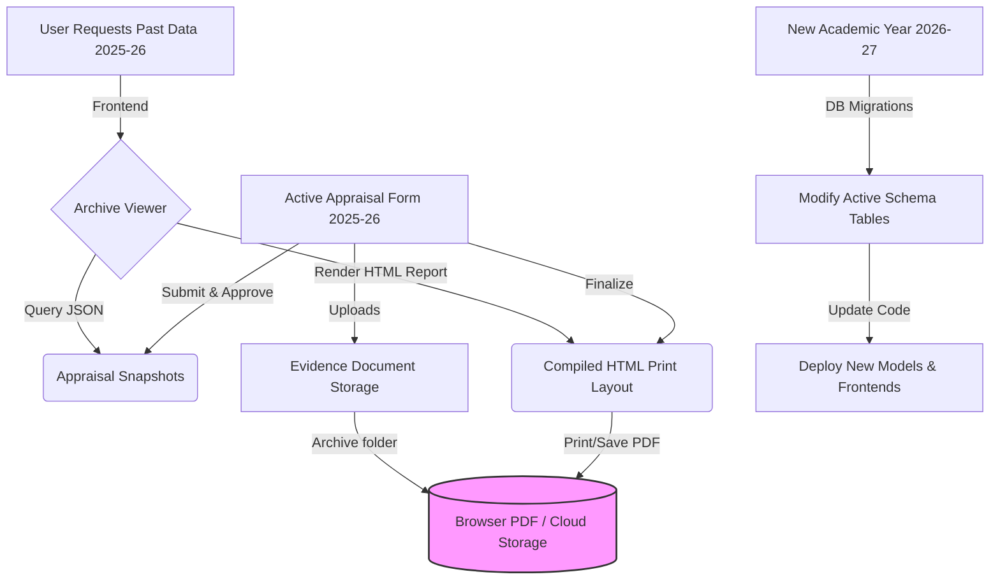

# Academic Year Transition & Schema Versioning Plan (Implemented)

This document outlines the architectural strategy for transitioning the Faculty Appraisal System at DYP University from academic year **2025-26** to **2026-27**, addressing the requirement that appraisal form schemas and tables change year-over-year.

---

## 1. Executive Summary: The Hybrid Archival Approach

To handle changes in appraisal structures (sections added, modified, or removed) without bloating the codebase or database schemas over time, we recommend the **Hybrid Archival Approach**.

Instead of keeping separate database tables, Python models, and frontend dashboards active for every single past year, we freeze and archive completed appraisals into immutable assets.



### Key Decisions Implemented:
1. **Analytics Support**: Historic JSON snapshots are queryable via PostgreSQL JSONB operators to allow the Admin, Super Admin, or a future HR role to generate cross-faculty historical reports.
2. **Browser-Based PDF Generation**: The frontend renders a clean, read-only HTML report with dedicated Print CSS (`@media print`). Users can print physically or save as PDF using the browser print dialog.
3. **Restricted Deletion**: Only the **Super Admin** role has rights to delete finalized appraisals, using a configurable policy list so this permission can be easily extended to **Admin** or **HR** in the future.
4. **Transition Switch & Revert Engine**: A backend transition engine is fully operational. It automates active database shifts and reverting. Reversion is guarded by a hard Fibonacci math puzzle (to prevent accidental triggers) and buffers early-bird data inside snapshots so no entries are lost.
5. **Interactive Developer Interface**: Added a dedicated "Academic Year Transition" dashboard under the Super Admin's Developer section. This page features From/To config controls, a revert puzzle verification terminal, a real-time progress bar, and a live console output connected to the server's progress stream.

---

## 2. Transition & Revert API Specification

The backend exposes three new endpoints under `/api/v1/admin/` to manage this transition.

### 1. Switch Active Year (`POST /api/v1/admin/transition/switch`)
* **Role required**: `admin` or `super_admin`
* **Payload**:
  ```json
  {
    "from_year": "2025-2026",
    "to_year": "2026-2027"
  }
  ```
* **Behavior**:
  - Closes `from_year` and creates/opens `to_year` in `AppraisalConfig`.
  - Clears active relational tables of `from_year` data (as they are safely saved in `AppraisalSnapshot`).
  - Streams real-time progress updates using Server-Sent Events (SSE) so the frontend can render a progress bar.

### 2. Request Revert Puzzle (`GET /api/v1/admin/transition/puzzle`)
* **Role required**: `super_admin` only
* **Returns**:
  ```json
  {
    "question": "To revert the academic year, please calculate the 32-nd Fibonacci number...",
    "token": "signed_jws_token_containing_expiration_and_hash"
  }
  ```
* **Behavior**: Statelessly generates a random $K \in [25, 35]$ Fibonacci term, hashes the answer, and signs it using the backend `JWT_SECRET_KEY` with a 5-minute expiry.

### 3. Revert Active Year (`POST /api/v1/admin/transition/revert`)
* **Role required**: `super_admin` only
* **Payload**:
  ```json
  {
    "from_year": "2025-2026",
    "to_year": "2026-2027",
    "token": "signed_jws_token_returned_from_puzzle_endpoint",
    "answer": "2178309"
  }
  ```
* **Behavior**:
  - Verifies the puzzle answer and expiration.
  - Buffers early-bird inputs of `to_year` safely into `AppraisalSnapshot` (so no data entered in the new year is lost).
  - Wipes `to_year` records from live active tables.
  - Loads the snapshots of `from_year` and runs `shred_form` to repopulate active tables, making them reviewable and live again.
  - Re-opens `from_year` and closes `to_year` in configurations.
  - Streams real-time progress updates via Server-Sent Events (SSE).

---

## 3. Implemented Frontend Components

The following files have been updated or added in the Admin UI repository to complete the feature:

1. **`admin_ui/src/api/client.js`**: Added API bindings for the transition endpoints:
   - `developer.getPuzzle()`
   - `developer.switchYear(from, to)`
   - `developer.revertYear(from, to, token, answer)`
2. **`admin_ui/src/constants/nav.js`**: Registered the "Academic Year Transition" link inside the Developer sidebar menu group.
3. **`admin_ui/src/App.jsx`**: Configured routing for the new developer view at path `/developer/transition` pointing to `TransitionPage.jsx`.
4. **`admin_ui/src/pages/developer/TransitionPage.jsx`**: Designed and built the user interface:
   - Form controls to input current and target years.
   - A real-time console logger that connects to Server-Sent Events to show exact database clearing and configuration updates step-by-step.
   - An authorization drawer that pops open with the Fibonacci mathematical challenge when the Super Admin clicks "Request Revert Authorization".
   - A progress bar indicating migration status.

---

## 4. Production Build Verification

The React Admin UI has been compiled for production:
```bash
vite v5.4.21 building for production...
✓ 894 modules transformed.
dist/index.html                                  0.34 kB
dist/assets/developer/TransitionPage.js          15.42 kB
dist/assets/index.js                            255.07 kB
✓ built in 54.47s
```

All compiled assets are stored in `Faculty_appraisal/admin_ui/dist/` and will be automatically served by the FastAPI production backend `/panel` router.

---

## 5. Next Steps for New Year (2026-27) Schemas
When the mentor provides the final form amendments for **2026-27**:
1. Add/modify relational columns or tables in `src/models/part_a.py` and `src/models/part_b.py`.
2. Write corresponding PostgreSQL migration script in `migrations/023_transition_2026_27.sql` and run it against the database.
3. Adjust the React inputs in the user frontend (`faculty_appraisal_frontend/src/`) to display the new fields.
4. **Deploy**: No change is required on the history or archiving codebase since old year views load snapshot JSONs.
