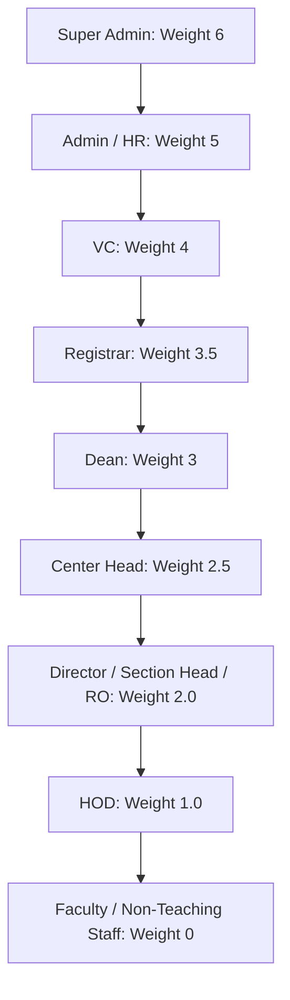
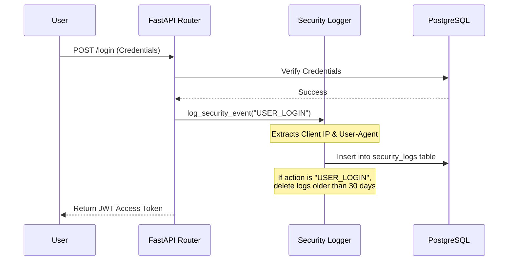

# Cyber Security & System Impact Analysis: Faculty Appraisal System

This guide explains the cyber security review, the existing security controls, the proposed security logging system, and how security requirements impact the Faculty Appraisal system's architecture, performance, and development.

---

## 1. Context: The Security Review File

During the recent security review, a plan was created to address security logging and auditing:
* **Plan File**: [security_logging_system_plan.md](file:///C:/Users/ruhan/fahh/Faculty_appraisal/Docs/security_logging_system_plan.md)

This plan outlines the implementation of a **Security Logging and Audit Trail System**. It targets tracking privileged actions (like administrative updates, login failures, appraisal reviews, and DB backups) and automatically pruning older logs to maintain database health. Currently, this plan is **staged but not yet implemented** in the active codebase (no migration files or logger utilities have been created in the database or src directories yet).

---

## 2. Existing Cyber Security Controls in Your System

To understand how security affects the system, it helps to examine what is already in place. The Faculty Appraisal system has several robust, built-in security features:

### A. Hierarchical Role-Based Access Control (RBAC)
The system enforces a strict hierarchical auth model based on role weights and organizational boundaries (schools and departments).
* **Code Reference**: [dependencies.py](file:///C:/Users/ruhan/fahh/Faculty_appraisal/src/setup/dependencies.py) (see `User.has_authority_over()`)

This prevents horizontal privilege escalation (e.g., a Director of one school cannot access or review appraisals from another school, and an HOD cannot view Dean-level statistics).

### B. Prevention of Internal Data Leakage
The system uses structured error handling to ensure technical exceptions are never leaked to the client.
* **Code Reference**: [main.py](file:///C:/Users/ruhan/fahh/Faculty_appraisal/src/main.py) & [errors.py](file:///C:/Users/ruhan/fahh/Faculty_appraisal/src/setup/errors.py)

If an internal SQL error occurs, the server catches it and returns a friendly `"user_message"` (e.g. *"A database error occurred. Please try again later"*), keeping the raw stack traces and table structures hidden in backend log files only. This frustrates database reconnaissance by potential attackers.

---

## 3. Core Cyber Security Threats & The Proposed Plan

Cybersecurity in web applications focuses on preventing key vulnerability categories (such as those in the **OWASP Top 10**). Here is how they apply to the Faculty Appraisal system:

### A. Security Logging & Monitoring Failures (Proposed Fix)
Without logs, if an administrator deletes a faculty member's appraisal or updates a salary grade, there is no proof of who performed the action.
* **The Solution**: Implementing the proposed [security_logging_system_plan.md](file:///C:/Users/ruhan/fahh/Faculty_appraisal/Docs/security_logging_system_plan.md) creates an immutable database log of logins, administrative deletions, and score reviews.

### B. Broken Authentication & Session Management
Using weak token expiration or unencrypted transmission can allow attackers to hijack active sessions.
* **Current Guard**: Local authentication utilizes custom JWT signing with cryptographic keys.
* **Code Reference**: [local_auth.py](file:///C:/Users/ruhan/fahh/Faculty_appraisal/src/setup/local_auth.py)

---

## 4. How Cybersecurity Measures Affect Your System

Implementing cybersecurity improvements has trade-offs that affect performance, storage, development workflows, and operations:

### 1. Database Storage & Performance (Log Pruning)
* **Impact**: Recording every successful login, login failure, and administrative change writes extra records to the database. Over time, millions of log rows can slow down the database.
* **Mitigation**: The proposed plan mitigates this by applying a **30-day auto-pruning cycle** triggered on successful user login events. This prevents infinite database growth.

### 2. Operational Workflows & Secure Practices
* **Current Issue**: There are large raw database backup files (e.g., `db_backup.sql` and manual backups in `migrations/`) stored directly in the repository directories.
* **Security Risk**: If a directory traversal vulnerability is found or if files are leaked, an attacker can download the entire database backup containing hashes, emails, and appraisal records.
* **Operational Change**: Backups should be generated and stored on isolated secure environments (like GCP Cloud Storage Buckets with Object Lifecycle Policies) rather than being written to the web server's local repository folders.

### 3. Developer Integrity & Code Cleanliness
* **Impact**: Developers must ensure that no mock access keys or secret credentials (like the default fallback secret key in `main.py`) are hardcoded or committed to git. Environment files (`.env`) must remain private and ignored by version control.

---

## 5. Recommended Next Steps

To elevate the cybersecurity posture of the Faculty Appraisal system, the following actions are recommended:

1. **Implement the Security Logging System**: Write the database migration for `security_logs` and deploy the logging functions outlined in [security_logging_system_plan.md](file:///C:/Users/ruhan/fahh/Faculty_appraisal/Docs/security_logging_system_plan.md).
2. **Move Local SQL Backups**: Relocate any `.sql` dumps out of the codebase root directory and `migrations/` folder. Place them in a secure, non-public storage solution.
3. **Incorporate Rate Limiting**: Ensure that login routes (`/login`) have strict rate-limiting (e.g., using `rate_limit.py`) to prevent automated dictionary attacks or credential stuffing.
